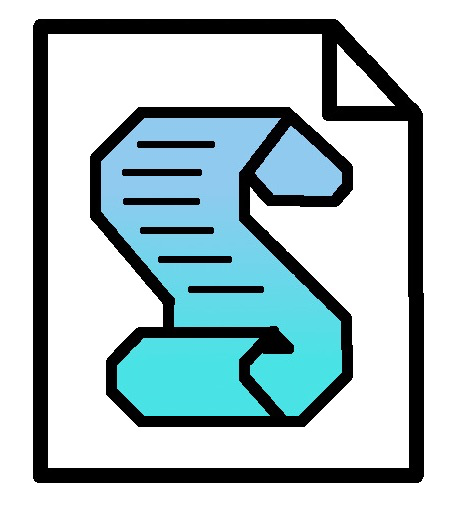

<!-- Begin README -->

    

 

    
     
    
    
    
     
    

---------------

<h1 align="center">VBScipt Greetings Program</h1>

A simple `VBScript` program that will greet you depending on the string length of your name.

---------------

## Table of Contents

- [What is VBScript?](#what-is-vbscript)
- [Getting Started](#getting-started)
- [Resources](#resources)
- [License](#license)
- [Credits](#credits)

## What is VBScript?

`VBScript` is a scripting language developed by Microsoft. It is a subset of the `Visual Basic` programming language and is used to program `ActiveX` controls and `Active Server Pages` (ASP). It is mostly used in the Windows environment for tasks such as automating processes, data manipulation, and user interface design.

## Getting Started

1. Double click the `GreetingScript.vbs` file on a Windows machine.
2. Enter your name and press `Enter`.
3. View the output.

## Resources

- [VBScript - Wikipedia](https://en.wikipedia.org/wiki/VBScript)
- [VBScript - Microsoft Docs](https://docs.microsoft.com/en-us/previous-versions/windows/internet-explorer/ie-developer/scripting-articles/t0aew7h6(v=vs.84))
- [VBScript - W3Schools](https://www.w3schools.com/asp/asp_ref_vbscript_functions.asp)
- [VBScript - Tutorialspoint](https://www.tutorialspoint.com/vbscript/index.htm)

## License

This project is released under the terms of **The Unlicense**, which allows you to use, modify, and distribute the code as you see fit. 
- [The Unlicense](https://choosealicense.com/licenses/unlicense/) removes traditional copyright restrictions, giving you the freedom to use the code in any way you choose.
- For more details, see the [LICENSE](LICENSE) file in this repository.

## Credits

**Author:** [Scott Grivner](https://github.com/scottgriv)  
**Email:** [scott.grivner@gmail.com](mailto:scott.grivner@gmail.com)  
**Website:** [linktr.ee/scottgriv](https://www.linktr.ee/scottgriv)  
**Reference:** [Main Branch](https://github.com/scottgriv/vbscript-greetings_program)  

---------------

    

<!-- End README -->
